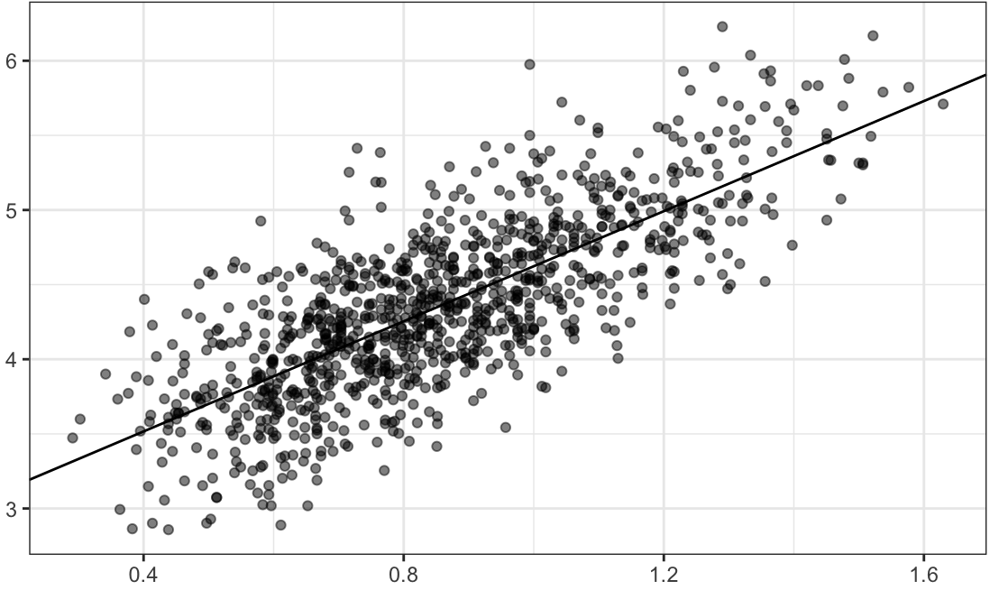

# Machine-Learning-Training

Author: Mohammadreza Ebrahimi  
Email: [m.reza.ebrahimi1995@gmial.com](mailto:m.reza.ebrahimi1995@gmial.com)  
***

I have created a portfolio for training machine learning. 

By study this repository you will be laern how to develope a two main model training in machine learning which are   
- Regression  
- Classification

Where those are subset of supervised learning.  
***

- Project 1: [Predict House Prices in California](https://github.com/mohammadreza-ebrahimi/Machine-Learning-Training/tree/main/House-Regression)
- Project 2: [Predict Gross Domestic Product (GDP) of a country](https://github.com/mohammadreza-ebrahimi/Machine-Learning-Training/tree/main/world-happiness)
- Project 3: [Classify Digit Numbers](https://github.com/mohammadreza-ebrahimi/Machine-Learning-Training/tree/main/Digit-Classifier)  
- Project 4: [Classify Mobile Prices](https://github.com/mohammadreza-ebrahimi/Machine-Learning-Training/tree/main/mobile)
- Project 5: [Classify Sky Objects](https://github.com/mohammadreza-ebrahimi/Machine-Learning-Training/tree/main/sky)

#### Project 1  
#### Project 2

In project 1, I used data from USA statistics dataset in order to analysis house data in california and build a model to predict the house value. Following steps 
is needed. Also in project 2 (supervised, regression, similar to the proj. 1) I have used GDP data for all over the world tho predict the GDP per capita of each country.  

- Getting some primary information about data
- Visualiaing data and see the correlation between features
- Splitting train set and test set by stratifying them
- Chooing the best model which is fitted to training data
- Evaluate cost function for each selected model

#### Project 3  
#### Project 4
#### Project 5
  

In project 3 I used data from MNIST dataset, a set of data included handwriting digit numbers. The aim pf this project is to predict which sets of array is related to which class. 
In projcet 4, I analyze data about mobiles and their **price range**. Project 5 is about to sky objects classification. Briefly, all of them are used to **classify binary or multi-lables**, following steps are being explained  

- Loading data from MNIST
- Getting some information about data
- Visualizing some of them as instance
- Splitting train set and test set
- Fixing target, divide traget column to two classes of `True` and `False` or `Yes` and `No` or even `1` and `0`. 
- Training data with **SGD Classifier**
- Evaluating **Percision** and **Recall** and **F1** for this model.

After above steps, I proceed in multi class model training with following steps  
- This time, It is not required to fix the tearget due to multi class model training
- Choosing appropriate model, again SGD classifier, by default it is **OvA**. I also examined **OvO** method.
- Test some other models
- Evaluating **Percision**, **Recall** and **F1**. 
- Visualizing **Confusion Matrix** in order to analysis errors

Some important concepts and definitions have been gotten from this [book](https://www.amazon.com/Hands-Machine-Learning-Scikit-Learn-TensorFlow/dp/1492032646) written by ***Aurélien Géron***  
If you have any question or suggestion please [contact](mailto:m.reza.ebrahimi1995@gmial.com) me. 
I will be happy.
